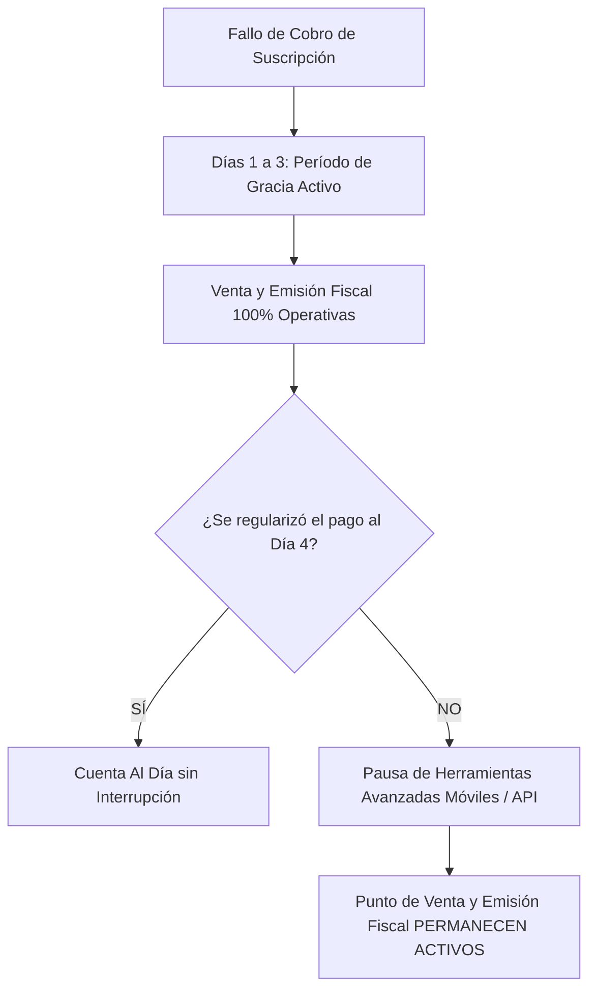

# Política de Cancelación, Reembolsos, Facturación de Excedentes y Garantía de 30 Días

> **Sitio Web Oficial:** `https://kipuspay.com`  
> **Contacto de Facturación:** `facturacion@kipuspay.com`  
> **Última actualización:** 12 de agosto de 2026  
> **Ámbito:** Reglas comerciales de contratación, facturación de consumos, políticas de cancelación y reembolsos de KipusPay.

---

## 1. Garantía de Prueba Gratuita por 30 Días

KipusPay (`https://kipuspay.com`) ofrece a todo nuevo comercio una **Garantía de Prueba Gratuita de 30 Días Calendario**, la cual se rige bajo los siguientes compromisos:

1. **Sin Tarjeta de Crédito:** El registro y uso durante los primeros 30 días no requiere ingresar datos de tarjeta de crédito ni autorizaciones de cobro automático.
2. **Funcionalidad Real en Punto de Venta:** El negocio utiliza KipusPay con sus datos reales de venta, catálogo y comprobantes de pago.
3. **Cero Compromiso:** Si al finalizar los 30 días el usuario decide no suscribir ningún plan, la cuenta se cierra sin generar deuda, cobro ni penalidad contractual alguna.

---

## 2. Política de Cancelación de Suscripción

### 2.1 Cancelación Libre en Planes Mensuales
- El Cliente puede cancelar su suscripción en cualquier momento desde el panel de administración (`Configuración -> Suscripción -> Cancelar cuenta`).
- No existen cláusulas de permanencia mínima ni penalidades por cancelación.
- Al solicitar la cancelación, El Servicio permanecerá activo hasta el último día del período mensual previamente pagado.

### 2.2 Reembolsos en Planes Anuales
Los planes anuales incluyen un beneficio comercial equivalente a 2 meses gratis (pago de 10 meses por 12 meses de servicio). En caso de que El Cliente solicite la resolución anticipada de un plan anual:
- Se calculará el monto utilizado tomando en cuenta los meses transcurridos a la tarifa regular mensual sin descuento.
- Se reembolsará el saldo remanente a favor de El Cliente a través del mismo método de pago utilizado en la compra dentro de un plazo de **15 días hábiles**.

---

## 3. Facturación de Comprobantes Adicionales (Excedentes / Overdraft)

De conformidad con el modelo comercial de KipusPay:

1. **Inclusión en Plan Arranque:** El plan Arranque incluye **1,000 comprobantes al mes** (Boletas, Facturas, Notas de Crédito, Notas de Débito y Notas de Venta).
2. **Tarifa por Excedente:** Todo comprobante emitido por encima de las 1,000 unidades incluidas se facturará a **S/ 0.05 (Cinco céntimos de sol)** por unidad adicional.
3. **Principio Anti-Apagado de Caja:** KipusPay **nunca bloquea ni detiene el funcionamiento de la caja registradora** por haber superado el cupo del plan. El cobro de los comprobantes adicionales se liquida a mes vencido en la factura del siguiente período.

---

## 4. Política Anti-Apagado por Fallos de Pago y Período de Gracia

En caso de que el cobro mensual recurrente sea rechazado por la entidad bancaria o pasarela de pagos (tarjeta vencida o fondos insuficientes):

1. **Período de Gracia (Días 1 a 3):** La caja registradora sigue cobrando y emitiendo comprobantes normalmente. Se muestra un banner amigable para actualizar la tarjeta.
2. **Pausa Selectiva (Día 4 en adelante):** Se pausan únicamente las herramientas avanzadas de gestión (Modo Dueño móvil, reportes de inteligencia y accesos API). **La caja registradora en la tienda y la emisión de comprobantes oficiales permanecen activas para que el negocio continúe operando.**

---

## 5. Procedimiento para Solicitudes de Reembolso y Disputas

Para solicitar la aplicación de un reembolso o presentar una inconformidad sobre la facturación de su cuenta:
1. El Cliente deberá enviar un correo a **`facturacion@kipuspay.com`** indicando el RUC del negocio, el comprobante de pago emitido por la suscripción y el motivo de la solicitud.
2. El equipo de facturación evaluará la solicitud y responderá en un plazo máximo de **3 días hábiles**.
3. De subsistir alguna disconformidad, El Cliente puede hacer uso del **Libro de Reclamaciones Virtual** disponible en `https://kipuspay.com/reclamaciones`, de acuerdo con el Código de Protección y Defensa del Consumidor (Ley N.º 29571).

---
