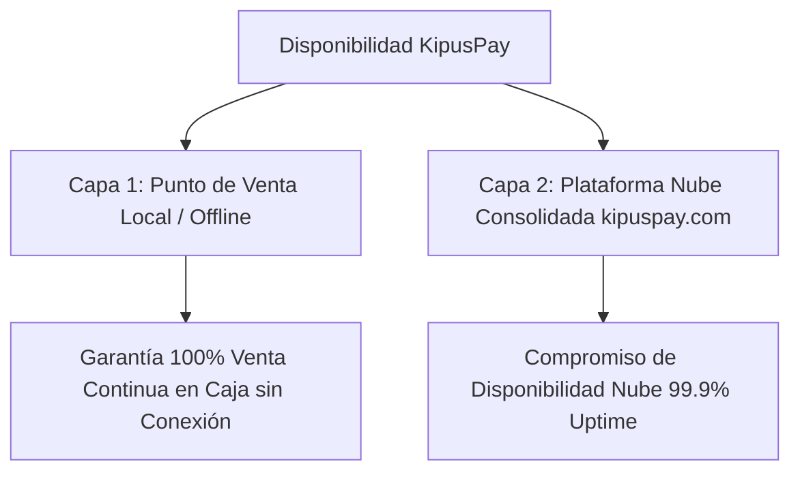

# Acuerdos de Nivel de Servicio, Disponibilidad y Soporte (SLA)

> **Sitio Web Oficial:** `https://kipuspay.com`  
> **Contacto de Soporte:** `soporte@kipuspay.com`  
> **Última actualización:** 12 de agosto de 2026  
> **Ámbito:** Términos de disponibilidad, niveles de servicio y compromisos de atención técnica de KipusPay.

---

## 1. Compromiso de Continuidad Operativa

KipusPay está diseñado bajo una arquitectura distribuida que garantiza contractualmente la **continuidad del cobro en el punto de venta**, aun ante caídas de conectividad a internet o cortes de energía eléctrica en el local del comercio.

### 1.1 Doble Capa de Disponibilidad

1. **Capa Local (Punto de Venta):** Garantía del 100% de operatividad para registrar ventas, procesar pagos en efectivo o tarjeta e imprimir tickets sin depender de internet.
2. **Capa Nube (Sincronización y Reportes en `kipuspay.com`):** Compromiso de disponibilidad mensual del **99.9% de uptime** para los servicios centralizados de administración, Modo Dueño, sincronización multi-caja y APIs.

---

## 2. Clasificación de Severidad de Incidentes y Tiempos de Respuesta

Un incidente se define como cualquier evento no planificado que interrumpa o reduzca la calidad del servicio. Los tiempos de respuesta representan el **compromiso de primer contacto humano calificado**:

| Nivel de Severidad | Definición y Criterio de Calificación | Tiempo de Respuesta (Estándar: Arranque / Crece / Cadena) | Tiempo de Respuesta (Prioritario: Enterprise) |
|---|---|---|---|
| **SEV-1 (Crítico)** | **Interrupción Total de Cobro en Caja:** Error crítico en el sistema que impide procesar ventas y cobros en el punto de venta. | 4 horas hábiles | **1 hora calendario (Atención 24/7)** |
| **SEV-2 (Alto)** | **Degradación de Servicios Fiscales o Reportes:** El punto de venta cobra con normalidad, pero existen demoras en la emisión fiscal o fallas en reportes. | 1 día hábil | **4 horas hábiles** |
| **SEV-3 (Normal)** | **Consultas Operativas y Configuración:** Consultas de uso, configuración de catálogos, impresoras o requerimientos informativos. | 2 días hábiles | **1 día hábil** |

---

## 3. Canales de Soporte y Horarios de Atención

- **Planes Arranque y Crece:** Soporte mediante chat integrado en la aplicación y correo electrónico oficial (`soporte@kipuspay.com`). Horario: Lunes a Viernes de 09:00 a 19:00 (Hora Perú).
- **Plan Cadena:** Chat prioritario en app, correo y asignación de un Account Manager dedicado en horario laboral peruano.
- **Plan Enterprise:** Chat prioritario, atención vía WhatsApp/Teléfono corporativo directo y guardia técnica de emergencia 24/7 para incidentes calificados como SEV-1.

---

## 4. Ventanas de Mantenimiento Programado

Para realizar actualizaciones de seguridad y mejoras de infraestructura en `kipuspay.com`, KipusPay podrá programar ventanas de mantenimiento técnico:
- **Horario:** Las labores se ejecutarán preferentemente entre las 01:00 AM y 05:00 AM (Hora Perú) en días de baja demanda.
- **Notificación Previa:** Se notificará a los usuarios con un mínimo de **48 horas de anticipación** a través del panel principal de administración.
- **Aislamiento de Caja:** Durante la ventana de mantenimiento en la nube, las cajas registradoras en los puntos de venta continúan operando de forma transparente en modo local.

---

## 5. Exclusiones de la Garantía del SLA

No se computarán como fallas del servicio ni generarán penalidades contractuales a cargo de KipusPay las siguientes situaciones:
1. Interrupciones originadas por la falla o suspensión del servicio del proveedor de internet contratado por el cliente.
2. Inoperatividad derivada del uso de dispositivos, computadoras o impresoras no homologadas o sin requisitos mínimos de sistema.
3. Caídas de sistema, cortes de mantenimiento o indisponibilidad confirmada en las plataformas centrales de SUNAT o RENIEC.
4. Caso fortuito o fuerza mayor (desastres naturales, cortes masivos de energía eléctrica ajenos al control de las partes).

---
